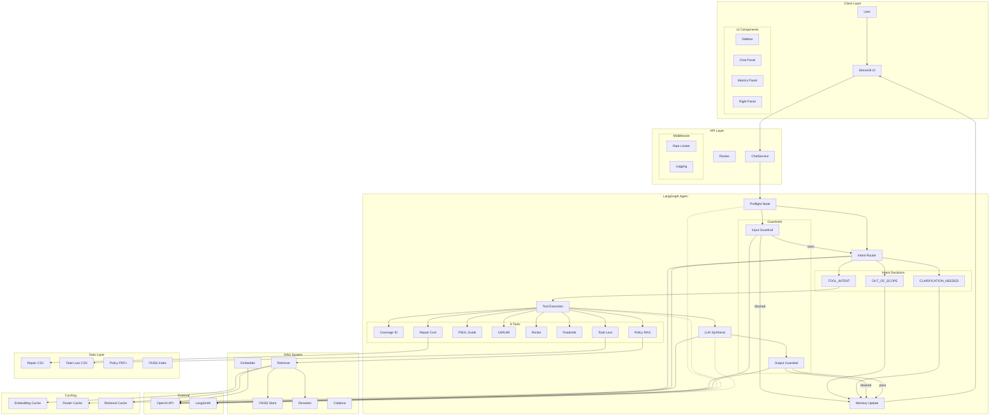

# RoadGuard AI Copilot — Full Architecture Diagram

## Latency by Component

| Component | Latency | Notes |
|-----------|---------|-------|
| Input Guardrail | ~200ms | GPT-4o-mini |
| Intent Router | ~300ms | GPT-4o-mini, parallel with guardrail |
| Tool Execution | ~1200ms | Parallel FAISS + Reranker + CSV |
| LLM Synthesis | **~3000ms** | **BOTTLENECK** |
| Output Guardrail | ~200ms | Rule-based + LLM checks |
| **Total** | **~5000ms** | |

## Key Features

- **Parallel preflight**: Guardrail + Router run together
- **Conditional flow**: Block / Tools / Clarify paths
- **8 Tools**: Coverage, RAG, FNOL, UM/UIM, Rental, Roadside, Repair, Total Loss
- **RAG Pipeline**: FAISS → Retriever → Reranker → Citations
- **3 Caches**: Embeddings, Router, Retrieval (LRU + TTL)
- **Streaming**: SSE tokens during synthesis

## Optimization Status

| Optimization | Status |
|-------------|--------|
| Parallel guardrail+router | ✅ |
| Reduce max_tokens 900→500 | ✅ |
| Top-3 chunks only | ✅ |
| Shorter history 10→3 | ✅ |
| Response caching | 🔄 Pending |
| Rule-based templates | 🔄 Pending |
