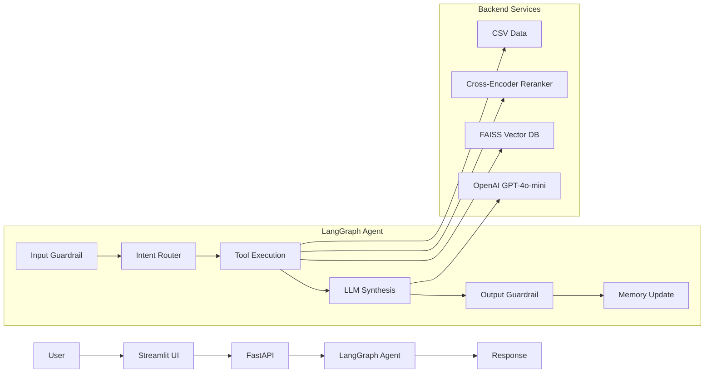

# RoadGuard AI Copilot — Architecture

## System Flow

## Latency Breakdown

| Component | Time |
|-----------|------|
| Input Guardrail | ~200ms |
| Intent Router | ~300ms |
| Tool Execution | ~1200ms |
| **LLM Synthesis** | **~3000ms** |
| Output Guardrail | ~200ms |
| Memory Update | ~50ms |
| **Total** | **~4950ms** |

## Tech Stack

- **Frontend**: Streamlit
- **Backend**: FastAPI
- **Agent**: LangGraph
- **LLM**: GPT-4o-mini
- **Vector DB**: FAISS
- **Embeddings**: text-embedding-3-small
- **Reranker**: cross-encoder/ms-marco-MiniLM

## Optimizations Applied

1. Parallel Guardrail + Router
2. Reduced synthesis tokens (900→500)
3. Top-3 chunks only in prompt
4. Truncated history (10→3 turns)
