# RoadGuard AI Copilot — Architecture Diagram

```mermaid
flowchart TB
    subgraph Client["🖥️ Client Layer"]
        USER["User (Browser)"]
        STREAMLIT["Streamlit UI<br/>ui/app.py"]
        subgraph UI_Components["UI Components"]
            SIDEBAR["Sidebar<br/>(policy tier, vehicle, state)"]
            CHAT["Chat Panel<br/>(messages, citations)"]
            METRICS["Metrics Panel<br/>(latency, confidence)"]
            RIGHT["Right Panel<br/>(context, docs)"]
        end
    end

    subgraph API["⚡ API Layer — FastAPI<br/>api/main.py"]
        ROUTES["Routes"]
        subgraph Middleware["Middleware"]
            RATE["Rate Limiter<br/>(Token Bucket)"]
            LOG["Structured Logging"]
        end
        subgraph Endpoints["Endpoints"]
            HEALTH["/health"]
            CHAT_API["/api/v1/chat"]
            SESSION["/session"]
        end
        CHAT_SERVICE["ChatService<br/>api/services/chat_service.py"]
    end

    subgraph Agent["🤖 Agent Layer — LangGraph<br/>agent/orchestrator.py"]
        direction TB
        START(["START"])
        PREFLIGHT["🔍 Preflight Node<br/>(parallel)"]
        
        subgraph Guardrail["Guardrails"]
            INPUT_GR["Input Guardrail<br/>check_input()"]
            OUTPUT_GR["Output Guardrail<br/>check_output()"]
        end
        
        ROUTER["🎯 Intent Router<br/>IntentRouter.classify()"]
        
        subgraph Intent_Decisions["Intent Decisions"]
            OUT_OF_SCOPE["OUT_OF_SCOPE → END"]
            CLARIFY["CLARIFICATION_NEEDED → END"]
            TOOLS["TOOL_INTENT → Execute Tools"]
        end
        
        TOOL_EXEC["🛠️ Tool Execution Node<br/>(asyncio.gather, parallel)"]
        
        subgraph Tools["Tool Registry<br/>_build_tool_registry()"]
            COV["Coverage Identifier"]
            RAG["Policy RAG<br/>(FAISS retrieval)"]
            FNOL["FNOL Guide"]
            UM["UM/UIM Lookup"]
            RENTAL["Rental Lookup"]
            ROAD["Roadside"]
            REPAIR["Repair Cost<br/>(CSV + fuzzy match)"]
            TOTAL["Total Loss<br/>(CSV + calc)"]
        end
        
        SYNTH["📝 LLM Synthesis<br/>gpt-4o, temp=0.2"]
        CONFIDENCE["📊 Confidence Score<br/>_compute_confidence()"]
        MEMORY["💾 Memory Update<br/>SessionStore"]
        END_NODE(["END"])
    end

    subgraph RAG_System["🔎 RAG System<br/>rag/"]
        EMBED["Embedder<br/>text-embedding-3-small"]
        FAISS["FAISS Vector Store<br/>(pre-loaded at startup)"]
        RETRIEVER["Retriever<br/>metadata-filtered top-k"]
        RERANKER["Reranker<br/>cross-encoder/ms-marco-MiniLM"]
        CITATION["Citation Tracker"]
    end

    subgraph Data_Layer["💾 Data Layer"]
        subgraph CSVs["CSV Files"]
            REPAIR_CSV["RepairCost_ReferenceTable.csv"]
            TOTAL_CSV["TotalLoss_Threshold_Table.csv"]
        end
        subgraph Documents["Documents"]
            PDFS["Policy PDFs<br/>data/pdfs/"]
            FAISS_IDX["FAISS Index<br/>data/faiss_index/"]
        end
    end

    subgraph External["🌐 External Services"]
        OPENAI["OpenAI API<br/>(embeddings, router, synthesis, guardrails)"]
        LANGSMITH["LangSmith<br/>(tracing & observability)"]
    end

    subgraph Caching["⚡ Caching Layer<br/>agent/cache.py"]
        EMBED_CACHE["Embedding Cache<br/>(LRU, 1hr TTL)"]
        ROUTER_CACHE["Router Cache<br/>(LRU, 1hr TTL)"]
        RETRIEVAL_CACHE["Retrieval Cache<br/>(LRU, 30min TTL)"]
    end

    subgraph Extraction["🔧 Parameter Extraction<br/>agent/param_extractor.py"]
        VEHICLE_MAP["Vehicle Make/Model<br/>→ Category Mapper"]
        DAMAGE_EXT["Damage Extraction<br/>(single + multi)"]
        PARAMS["Structured Params<br/>(ACV, state, year)"]
    end

    %% Connections
    USER --> STREAMLIT
    STREAMLIT --> CHAT
    CHAT --> CHAT_API
    SIDEBAR --> CHAT_API
    
    CHAT_API --> CHAT_SERVICE
    CHAT_SERVICE --> PREFLIGHT
    
    PREFLIGHT --> INPUT_GR
    PREFLIGHT --> ROUTER
    
    INPUT_GR -->|blocked| END_NODE
    INPUT_GR -->|pass| ROUTER
    
    ROUTER --> OUT_OF_SCOPE
    ROUTER --> CLARIFY
    ROUTER --> TOOLS
    
    OUT_OF_SCOPE --> END_NODE
    CLARIFY --> END_NODE
    TOOLS --> TOOL_EXEC
    
    TOOL_EXEC --> COV
    TOOL_EXEC --> RAG
    TOOL_EXEC --> FNOL
    TOOL_EXEC --> UM
    TOOL_EXEC --> RENTAL
    TOOL_EXEC --> ROAD
    TOOL_EXEC --> REPAIR
    TOOL_EXEC --> TOTAL
    
    RAG --> RETRIEVER
    RETRIEVER --> EMBED_CACHE
    RETRIEVER --> RETRIEVAL_CACHE
    RETRIEVER --> FAISS
    RETRIEVER --> RERANKER
    RETRIEVER --> CITATION
    
    COV --> RAG
    
    REPAIR --> REPAIR_CSV
    TOTAL --> TOTAL_CSV
    TOTAL --> REPAIR
    
    RAG --> PDFS
    FAISS --> FAISS_IDX
    
    EMBED --> OPENAI
    EMBED --> EMBED_CACHE
    ROUTER --> OPENAI
    ROUTER --> ROUTER_CACHE
    SYNTH --> OPENAI
    INPUT_GR --> OPENAI
    OUTPUT_GR --> OPENAI
    
    CHAT_SERVICE --> PARAMS
    PARAMS --> VEHICLE_MAP
    PARAMS --> DAMAGE_EXT
    
    TOOL_EXEC --> SYNTH
    SYNTH --> OUTPUT_GR
    OUTPUT_GR -->|blocked| END_NODE
    OUTPUT_GR -->|pass| CONFIDENCE
    CONFIDENCE --> MEMORY
    MEMORY --> END_NODE
    
    END_NODE --> CHAT_SERVICE
    CHAT_SERVICE --> CHAT_API
    CHAT_API --> STREAMLIT
    STREAMLIT --> USER
    
    %% Observability
    PREFLIGHT -.->|traces| LANGSMITH
    TOOL_EXEC -.->|traces| LANGSMITH
    SYNTH -.->|traces| LANGSMITH
    
    %% Styling
    style Client fill:#e1f5fe
    style API fill:#fff3e0
    style Agent fill:#e8f5e9
    style RAG_System fill:#f3e5f5
    style Data_Layer fill:#fce4ec
    style External fill:#fff8e1
    style Caching fill:#e0f2f1
    style Extraction fill:#e8eaf6
    style Tools fill:#f1f8e9
    style Guardrail fill:#ffebee
    style Intent_Decisions fill:#fff9c4
```

---

## Component Breakdown

| Layer | File | Responsibility |
|-------|------|---------------|
| **UI** | `ui/app.py` | Streamlit entry, theme, health check |
| | `ui/components/sidebar.py` | Policy tier, vehicle, state inputs |
| | `ui/components/chat_panel.py` | Message history, citations, typing indicator |
| | `ui/components/metrics_panel.py` | Latency, confidence, tool usage |
| **API** | `api/main.py` | FastAPI factory, lifespan (warmup), middleware |
| | `api/routes/chat.py` | `/api/v1/chat` endpoint |
| | `api/services/chat_service.py` | Business logic, state hydration, response shaping |
| **Orchestrator** | `agent/orchestrator.py` | LangGraph graph: guardrail → router → tools → synthesis → output guardrail |
| | `agent/router.py` | Intent classification (gpt-4o-mini) |
| | `agent/state.py` | TypedDict state schema |
| **Tools** | `agent/tools/repair_cost_tool.py` | CSV lookup + fuzzy damage match |
| | `agent/tools/total_loss_tool.py` | Threshold comparison + calculation |
| | `agent/tools/policy_rag_tool.py` | FAISS retrieval + reranking |
| | `agent/tools/*.py` | 8 total tools (coverage, FNOL, rental, roadside, UM/UIM) |
| **RAG** | `rag/retriever.py` | FAISS search + metadata filtering + caching |
| | `rag/faiss_store.py` | Index loading/storage |
| | `rag/reranker.py` | cross-encoder reranking |
| | `ingestion/embedder.py` | OpenAI embedding with LRU cache |
| **Extraction** | `agent/param_extractor.py` | Vehicle make/model → category, damage phrases, structured params |
| **Guardrails** | `guardrails/input_guardrails.py` | Block toxic/off-topic input |
| | `guardrails/output_guardrails.py` | Verify citations, dollar values |
| **Caching** | `agent/cache.py` | LRU + TTL caches for embeddings, router, retrieval |
| **Observability** | `observability/langsmith_tracer.py` | LangSmith trace URLs |
| | `observability/logger.py` | Structured JSON logging |

## Data Flow (Single Request)

1. **User** types query in Streamlit → `ChatRequest` to `/api/v1/chat`
2. **ChatService** hydrates session context + extracts params from message
3. **Orchestrator** runs LangGraph:
   - `preflight`: Input guardrail + intent router in **parallel**
   - `tool_execution`: Selected tools run in **parallel** via `asyncio.gather`
   - `llm_synthesis`: gpt-4o synthesizes grounded answer from tool results
   - `output_guardrail`: Verifies no hallucinated citations or dollar values
   - `memory_update`: Stores turn in session history
4. **Response** returns with answer, citations, tool results, confidence score
5. **Streamlit** renders message + inline citations + metrics panel

## Key Design Decisions

- **Parallel preflight**: Input guardrail + intent router run together (~400ms saved)
- **Parallel tool execution**: All selected tools fan out simultaneously
- **Deterministic tool order**: Results sorted before synthesis so LLM sees consistent ordering
- **3-tier caching**: Embeddings → Router decisions → Retrieval results, each with TTL
- **Vehicle mapper**: "Honda Civic" → "Economy/Compact" without user dropdown
- **Multi-damage support**: "headlight and hood" → 2 CSV lookups → aggregated cost range
- **Confidence heuristic**: Tool success (35%) + citations (25%) + relevance (30%) + synthesis (10%)
